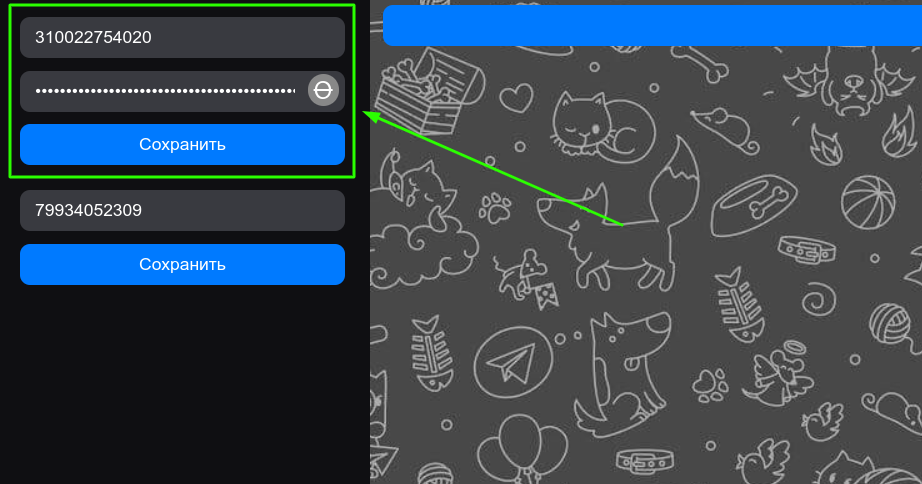
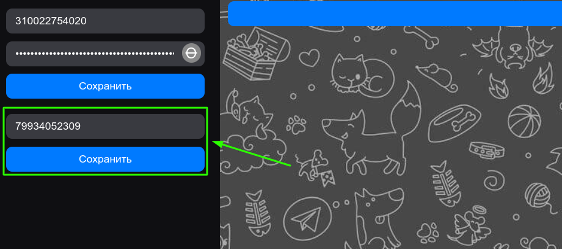
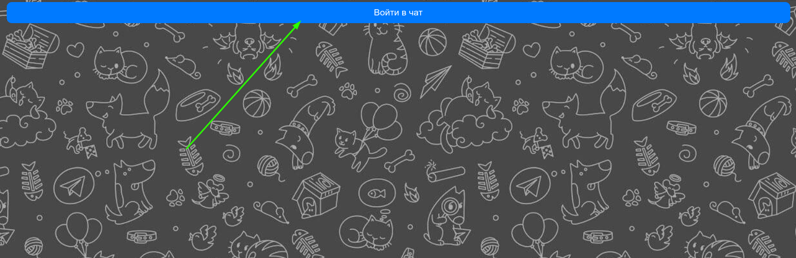
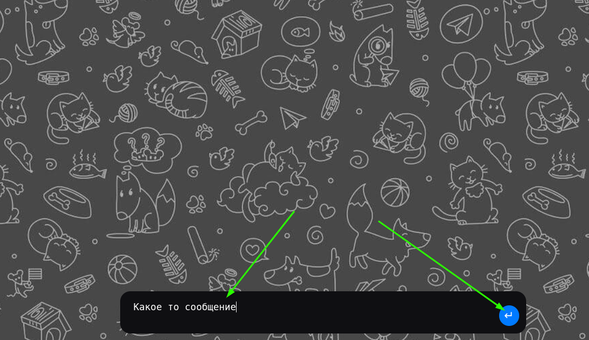
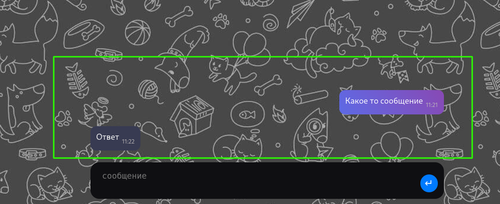

<h1>Тестовое задание для компании "Green-api"</h1>

<h2>Запуск проекта</h2>
1.Склонируйте репозиторй
<b>git@github.com:ruslan1984/green-api.git</b>

2.Перейдите в папку с проектам
<b> cd green-api</b>

3.Установте зависимости
<b>pnpm install</b>

4.Выполните в кнослои команду
<b>pnpm dev</b>

5.Проект запущен локально на порту <b>localhost: 5173</b>

<h2>Проверка работы</h2>

1. Введите idInstance и apiTokenInstance

2. Введите номер телефона получателя

3. Нажмите кнопку начать чать
   

4. Введите текст и нажмите кнопку отправки

4. Дождитесь ответа. Если непрочтитанных сообщений очень много ответ может прийти не сразу

<h2>Принцип работы</h2>

Отправка сообщения происходит медотом
<b>POST {{apiUrl}}/waInstance{{idInstance}}/sendMessage/{{apiTokenInstance}}
</b>

Прием сообщения вызывается метод
<b>{{apiUrl}}/waInstance{{idInstance}}/receiveNotification/{{apiTokenInstance}}?receiveTimeout={{seconds}}
</b>

с последующим удалением уведомлений
<b>DELETE {{apiUrl}}/waInstance{{idInstance}}/deleteNotification/{{apiTokenInstance}}/{{receiptId}}
</b>

запрос выполняется каждые 3 секунды

Видел обширный api, но исходя из требований задания реализовал только эти два метода.

Возможные ошибки: может быть долгий от вет от сервера и приложение останавливает работу со статусом 408 или 502

<h2>Структура кода:</h2>

- components - компоненты
- modules - более сложные конструкции
- store - глобальное состояние. использовал mobX, mobX использует useContext
- layout - шаблон страниц
- hooks - хуки
- assets - картинки
